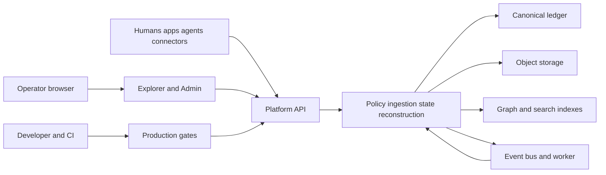

# Woyengi Platform threat model

## Executive summary

Woyengi Platform protects long-lived, authority-bearing state assembled from user artifacts, applications, connectors, and agents. The dominant risks are cross-principal reconstruction leakage, unauthorized state mutation, poisoned observations becoming governing state, residual data after invalidation, and compromise of broadly privileged local/operator credentials. The strongest control points are the API authentication/capability boundary, record-level reconstruction authorization, provisional semantic and agent writes, provenance-driven invalidation, and append-oriented audit history. Cloud risk remains conditional because the checked-in deployment is explicitly local, while the architecture anticipates multi-tenant managed use.

## Scope and assumptions

- In scope: `apps/`, `packages/`, `services/`, `deploy/`, `production/`, `scripts/`, `schemas/`, and `migrations/`.
- Runtime includes Platform API, Platform Worker, Explorer, administrator diagnostics, ledger/object/search adapters, connectors, sync, and reconstruction. CI/build tooling is modeled separately and is not treated as a runtime entry point.
- Assumption: state may include restricted personal and organizational information; confidentiality and historical integrity are critical.
- Assumption: the Compose profile is local/private with one trusted operator token, but public contracts may later be internet-facing and multi-tenant. Threats that depend on cloud exposure are marked conditional.
- Assumption: TLS and external identity/session management terminate before a managed Platform API. The repository does not implement that edge.
- Out of scope: Woyengi Compute/model execution, product-domain repositories, host OS/WSL security, managed-provider controls, and physical device compromise.
- Open questions: final internet exposure, tenancy model, regulated data classes, identity provider, key-management service, retention jurisdictions, and recovery objectives. Answers can raise or lower TM-001, TM-002, TM-008, and TM-009.

## System model

### Primary components

- Platform API accepts authenticated INGEST, STATE, RECONSTRUCT, and CONTROL requests, then performs operation authorization (`services/platform-api/src/index.ts`, `PlatformApi`).
- The modular runtime composes ingestion, state, reconstruction, verification, policy, sync, and event modules in process; the durable worker executes idempotent retryable jobs (`services/runtime/src/index.ts`).
- Canonical history and artifacts persist in ledger/object stores; graphs, search, vectors, and caches are rebuildable adapters (`packages/storage/src/index.ts`, `packages/ledger/src/index.ts`).
- Reconstruction plans state requirements, authorizes the request and every retrieved record, resolves temporal/authority/evidence context, and emits a structured workspace (`packages/reconstruction/src/index.ts`, `ReconstructionEngine`).
- Explorer and administrator diagnostics expose inspection surfaces; diagnostics recursively redact content and credentials before rendering (`apps/explorer/src/index.ts`, `apps/admin-console/src/index.ts`).
- Production tooling performs strict compilation, dependency-boundary, secret, data, benchmark, observability, and release checks (`production/scripts/production-os.js`).

### Data flows and trust boundaries

- Human/application/connector/agent → Platform API: JSON observations, claims, actions, credentials, and idempotency keys over HTTP. Bearer authentication, pre-auth throttling, 1 MiB bodies, route matching, and operation authorization apply; TLS is expected at an external edge.
- Platform API → semantic/state modules: validated JSON state and authenticated principal context over in-process calls. Generated proposals remain provisional; authority and confidence are separate.
- Reconstruction planner → retrieval adapters → assembler: intent, temporal cutoffs, graph/search candidates, evidence, and conflicts over typed in-process ports. Request authorization precedes retrieval and record-level authorization precedes assembly.
- Platform modules → ledger/object/search stores: canonical records, artifacts, indexes, and derived projections over storage adapters. Ledger history is append-oriented; indexes are non-canonical and rebuilt after invalidation.
- Platform API → worker/event consumers: idempotent jobs and state-change events. Durable job state, bounded retries, and stable delivery identifiers apply.
- Operator browser → Explorer/admin: inspected state or redacted diagnostics over same-origin HTTP. Entity data requires an explicit Explorer authorization decision; administrator operations require confirmation and audit.
- Developer/CI → release artifacts: source, lockfile, compiler, container definitions, and gate evidence. Pinned dependencies, secret scanning, boundary enforcement, and fail-closed release aggregation apply.

#### Diagram

## Assets and security objectives

| Asset | Why it matters | Security objective (C/I/A) |
|---|---|---|
| Personal and organizational state | Disclosure or falsification can harm users and decisions | C, I, A |
| Canonical bitemporal ledger | Governs replay, time travel, audit, and projections | I, A |
| Evidence and provenance DAG | Explains and invalidates derived state | I, A |
| Capabilities and authority decisions | Enforce purpose, scope, sensitivity, and governing sources | C, I |
| Source artifacts and residual detail | May contain the most sensitive raw content | C, I, A |
| API/operator credentials | Grant access to state and control operations | C, I |
| Audit, traces, and metrics | Support detection, accountability, and incident reconstruction | C, I, A |
| Sync operations and worker jobs | Replicate or mutate state across devices and services | I, A |
| Build, lockfile, and container artifacts | Determine executed code and supply-chain integrity | I, A |

## Attacker model

### Capabilities

- A remote unauthenticated actor can send malformed, repeated, or oversized HTTP requests if the API is exposed.
- An authenticated but scope-limited user or compromised agent can submit adversarial observations, reconstruction requests, proposals, and actions.
- A malicious connector can replay, reorder, omit, or poison external records.
- A local operator or compromised workstation can invoke CLI/admin surfaces and access local files within OS permissions.
- A supply-chain attacker may attempt dependency, image-tag, or CI artifact substitution.

### Non-capabilities

- The model does not assume host administrator/root access, cryptographic breaks, physical device access, or control of managed TLS/KMS infrastructure.
- Product-domain code and Woyengi Compute/model execution are not present here and cannot be assessed.
- A remote actor cannot directly invoke production scripts or the local CLI without a separate host/CI compromise.

## Entry points and attack surfaces

| Surface | How reached | Trust boundary | Notes | Evidence (repo path / symbol) |
|---|---|---|---|---|
| Platform HTTP API | `/v1/ingest`, `/v1/state`, `/v1/reconstruct`, `/v1/control` | Network → API | Auth, throttle, 1 MiB JSON bound, operation auth | `services/platform-api/src/index.ts` / `PlatformApi.#handle` |
| Health/readiness | `/healthz`, `/readyz` | Orchestrator → API | Unauthenticated, returns status/check names only | `services/platform-api/src/index.ts` / `matchOperationalRoute` |
| Explorer entity API | `/api/entities/:id` | Browser → Explorer | Explicit authorization callback before load | `apps/explorer/src/index.ts` / `ExplorerApp.#handle` |
| Administrator diagnostics | Same-origin diagnostics and guarded operations | Operator → admin service | Recursive redaction, default-deny auth, exact confirmation, audit | `apps/admin-console/src/index.ts` / `AdminDiagnostics` |
| Connector delivery | SDK pull/cursor operations | External app → ingestion | Stable idempotency keys and cursors; connector remains untrusted | `packages/connector-sdk/src/index.ts` |
| Agent gateway | Read, propose write, execute | Agent → platform | Separate grants, provisional writes, verification and procedure guards | `packages/agent-sdk/src/index.ts` / `AgentGateway` |
| Sync fabric | Device operations | Device/local → cloud | Storage policy and object-specific conflict semantics | `packages/sync/src/index.ts` |
| Workspace CLI | Arguments and local archives | Operator → filesystem | Safe paths, no symlink backup, hashed archive, empty restore target | `packages/cli/src/index.ts` |
| Worker jobs | Durable job store | Modules → worker | Idempotency, retries, event lifecycle, redacted errors | `services/runtime/src/index.ts` / `PlatformWorker` |
| Build/release gates | Developer/CI invocation | Source → release | Strict compiler, graph boundaries, secret scan, benchmarks | `production/scripts/production-os.js` |

## Top abuse paths

1. Cross-tenant disclosure: attacker authenticates with a limited principal → requests a broad reconstruction → poisoned retrieval returns restricted IDs → record authorization removes them before assembly; impact is prevented unless the authorization implementation itself grants the scope.
2. Authoritative-state poisoning: malicious connector/agent submits a confident false statement → semantic compiler/agent gateway stores a provisional proposal → attacker attempts to bypass verification/authority → projection must prefer governing verified authority; successful bypass would corrupt decisions.
3. Credential brute force and API exhaustion: remote actor sprays bearer values and bodies → pre-auth sliding-window limit and 1 MiB cap constrain work → distributed attacks still require edge throttling/WAF.
4. Deleted-data recovery: user invalidates an artifact → downstream claims/projections/reconstructions become unsupported and indexes purge IDs → stale external caches or unimplemented adapters could still retain bytes unless their deletion contract is verified.
5. Operator compromise: attacker obtains the local admin token → all local operations are intentionally privileged → ledger/audit evidence remains, but confidentiality and integrity are lost until token rotation and restore.
6. Diagnostic exfiltration: malicious connector puts secrets in status/error payloads → recursive key redaction removes credentials/content → unusual unkeyed secrets may remain a residual risk and should be detected at the source.
7. Supply-chain substitution: attacker changes a package or container tag → lockfile/compiler and CI gates catch package drift → container tags without immutable digests leave a conditional substitution window.
8. Archive resource exhaustion: operator opens an attacker-supplied backup → parser verifies paths and hashes but reads the JSON archive in memory → a very large local archive can exhaust memory; remote reach requires a separate upload path not present here.

## Threat model table

| Threat ID | Threat source | Prerequisites | Threat action | Impact | Impacted assets | Existing controls (evidence) | Gaps | Recommended mitigations | Detection ideas | Likelihood | Impact severity | Priority |
|---|---|---|---|---|---|---|---|---|---|---|---|---|
| TM-001 | Remote actor | Internet exposure and reachable API | Brute-force token or exploit overly broad principal grant | Full state disclosure/mutation | Credentials, canonical state, artifacts | Constant-time hashed bearer compare, pre-auth rate limit, operation auth (`services/platform-api/src/security.ts`; `src/index.ts`) | Local profile uses one broad operator token; no repository IdP/rotation | For managed use require OIDC/mTLS, short-lived tokens, key rotation, edge throttling, and capability issuance per tenant/purpose | Alert on 401/403/429 rate and unusual control operations | Medium conditional | High | High |
| TM-002 | Authenticated user/agent | Valid but limited credential | Cause reconstruction to assemble a restricted record | Cross-tenant or purpose-boundary data leak | State, evidence, artifacts | Request and record-level authorization before assembly (`packages/reconstruction/src/index.ts`) | Authorization port correctness is deployment-specific | Add tenant/purpose fixtures to E2E and deny if record authorization is unavailable | Permission-leakage metric and denied-record count anomaly | Medium | High | High |
| TM-003 | Connector or agent | Ability to ingest/propose | Submit false/high-confidence state and seek governing projection | Integrity corruption and unsafe actions | Claims, projections, decisions | Provisional proposals, separate confidence/authority, verifiers and lifecycle (`packages/agent-sdk/src/index.ts`; `packages/authority/src/index.ts`) | Domain verifier quality remains external | Require authority policy and evidence threshold for every governing predicate; quarantine anomalous sources | Verification failure, authority inversion, conflict rate | Medium | High | High |
| TM-004 | Authorized deleter or stale consumer | Source invalidation plus dependent indexes | Recover or use unsupported derived state | Privacy breach or stale decision | Artifacts, indexes, reconstructions | Provenance propagation and index purge (`packages/lifecycle/src/index.ts`) | External adapter deletion/retention implementations require conformance tests | Add adapter deletion certification and cache purge acknowledgements | Unsupported-record retrieval and stale-index metrics | Low | High | Medium |
| TM-005 | Remote actor | Network reachability | Send bursts, malformed JSON, or large inputs | Availability loss | API, worker, storage | Header/parser defaults, 1 MiB body cap, rate limit, bounded worker attempts (`services/platform-api/src/index.ts`; `services/runtime/src/index.ts`) | No distributed edge limit or per-principal compute budget | Enforce gateway request/time/compute budgets and backpressure | 413/429, latency, queue-depth alerts | Medium conditional | Medium | Medium |
| TM-006 | Malicious device/connector | Valid sync or connector channel | Replay/reorder/conflict operations to replace authority | State divergence or integrity loss | Sync state, authoritative records | Idempotency, cursors, storage policy, authoritative conflict stop (`packages/sync/src/index.ts`; `packages/connector-sdk/src/index.ts`) | No signed device operation protocol in repository | Sign operations, bind device identity, enforce monotonic cursors where appropriate | Duplicate rate, rejected authoritative conflicts | Medium | Medium | Medium |
| TM-007 | Operator UI data source | Secret embedded in diagnostics/error | Cause secret to render or persist in telemetry | Credential/content disclosure | Secrets, logs, diagnostics | Same-origin session request, recursive redaction, telemetry redaction, worker error scrubbing (`apps/admin-console`; `packages/observability`; `services/runtime`) | Heuristic redaction cannot classify every value | Prefer allowlisted diagnostic schemas and structured error codes | Secret-scan telemetry samples in controlled test environments | Low | High | Medium |
| TM-008 | Supply-chain actor | Registry/CI compromise | Replace dependency or container behind a mutable reference | Code execution/data compromise | Build artifacts, runtime | Pinned TS/Node types, lockfile policy, nonroot hardened image, fail-closed gates (`pnpm-lock.yaml`; `deploy/docker`; `production/scripts`) | Container references use version tags, not digests; no signing/SBOM attestation | Pin image digests, generate SBOM, verify signatures/provenance in CI | Alert on digest/baseline drift | Low | High | Medium |
| TM-009 | Host/storage attacker | Filesystem or volume access | Read raw ledger/artifact bytes or alter files | Confidentiality/integrity loss | Ledger, object store, backups | OS/container separation, hash-addressed objects, integrity checks, local-only policy (`packages/storage`; `packages/cli`) | At-rest encryption/KMS is policy metadata, not enforced by local adapters | Envelope-encrypt restricted objects and sign ledger checkpoints with managed keys | Integrity scan and unexpected-decryption/key-use alerts | Medium conditional | High | High conditional |
| TM-010 | Privileged insider | Write access to audit storage | Alter/delete audit and trace history | Detection and accountability loss | Audit, traces, incident evidence | Append-oriented canonical records and correlated audits (`packages/observability`; `apps/admin-console`) | No immutable external audit sink or checkpoint signatures | Export signed audit checkpoints to write-once storage | Missing sequence/checkpoint and deletion alerts | Low | High | Medium |

## Criticality calibration

- Critical: pre-auth remote code execution; universal authentication bypass; undetectable compromise of canonical state across all tenants.
- High: cross-tenant restricted-state disclosure; broadly privileged credential theft; verified/authoritative state corruption; raw volume disclosure of restricted content.
- Medium: targeted availability exhaustion; stale deleted-data exposure in one adapter; diagnostic leakage requiring operator access; replay stopped as an explicit conflict.
- Low: low-sensitivity metadata disclosure; noisy failures with intact audit; developer-only tooling issues requiring trusted repository write access.

## Focus paths for security review

| Path | Why it matters | Related Threat IDs |
|---|---|---|
| `services/platform-api/src/index.ts` | Network parser, authN/authZ order, routes, limits, and errors | TM-001, TM-005 |
| `services/platform-api/src/security.ts` | Credential comparison and rate-limit state | TM-001, TM-005 |
| `services/platform-api/src/main.ts` | Concrete local principal and broad operator authorization | TM-001, TM-009 |
| `packages/permissions/src/index.ts` | Capability, delegation, sensitivity, purpose, and scope semantics | TM-001, TM-002 |
| `packages/reconstruction/src/index.ts` | Permission-to-retrieval-to-assembly confidentiality boundary | TM-002 |
| `packages/agent-sdk/src/index.ts` | Agent proposal/write/action authority separation | TM-003 |
| `packages/semantic-compiler/src/index.ts` | Untrusted content becomes typed provisional state | TM-003 |
| `packages/authority/src/index.ts` | Governing-source ranking independent from confidence | TM-003 |
| `packages/lifecycle/src/index.ts` | Deletion/invalidation and downstream leakage prevention | TM-004 |
| `packages/provenance/src/index.ts` | Dependency traversal determining invalidation impact | TM-004 |
| `packages/sync/src/index.ts` | Device/cloud locality and authoritative conflict semantics | TM-006 |
| `packages/connector-sdk/src/index.ts` | Untrusted external cursor/idempotency boundary | TM-003, TM-006 |
| `apps/admin-console/src/index.ts` | Privileged operations, redaction, confirmation, audit | TM-007, TM-010 |
| `packages/observability/src/index.ts` | Sensitive telemetry redaction and audit correlation | TM-007, TM-010 |
| `packages/cli/src/index.ts` | Backup/restore parsing, paths, integrity, local resource use | TM-005, TM-009 |
| `packages/storage/src/index.ts` | Durable ledger/object filesystem integrity | TM-009, TM-010 |
| `deploy/docker/compose.yaml` | Secrets, network exposure, container privilege, image supply chain | TM-001, TM-008, TM-009 |
| `production/scripts/production-os.js` | Central release blocking policy | TM-008 |
| `production/scripts/security_scan.js` | Secret and unresolved-finding enforcement | TM-007, TM-008 |

## Notes on use

- Covered API, UI, connector, agent, sync, CLI, worker, storage, and build entry points.
- Every identified runtime trust boundary appears in at least one threat.
- Runtime behavior is separated from CI/developer tooling throughout.
- No clarification was received before drafting; internet exposure, tenancy, regulated data, IdP, and KMS conclusions remain explicit assumptions.
- Revisit priorities whenever the deployment moves beyond loopback/private networking or introduces domain-specific parsers and actions.
